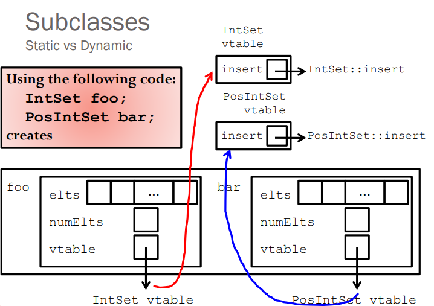

# C++ and Algorithms for Interview

### Small points

- `x++` increments the value of variable `x` **after** processing the current statement. `x+=i++;` add `i` to `x` then increase `i` by 1. 
- `++x` increments the value of `x` **before** processing the current statement. `x+=++i;` increase `i` and add `i+1` to `x`.
- Array is passed by reference. `array = &array[0]`.
- Reference must be initialized using a variable of the same type.
- Enumerate example:
```
enum Suit_t {A, B, C, D};
const string Name[] = {"A", "B", "C", "D"};
enum Suit_t x = C;
std::cout << Name[x] << std::endl;
```

### Function pointer

For functions that have precisely the same type signature, a function pointer allow us to call them the same way from a syntactic point of view.

Example:

```
int min(int a, int b);
// EFFECTS: returns the smaller of a and b.

int max(int a, int b);
// EFFECTS: returns the larger of a and b.

int (*foo)(int, int);

// Then we can let foo = min or max and call
foo(5, 3); //for example
```

### Memory
 - Memory leak is caused when not recycling an allocated dynamic object.
 - Check memory leak: `valgrind --leak-check=full ./program <args>`
 - The space for objects created via `new` comes from heap.
 - Stack is for function calls.
 - 

### Struct and class
 - The default copy constructor is shallow copy, which works when there is not points in the member of that data type.  
 
 - The sizeof for a struct is not always equal to the sum of sizeof of each individual member. This is because of the padding added by the compiler to avoid alignment issues. Padding is only added when a structure member is followed by a member with a larger size or at the end of the structure.
 
    - Different compilers might have different alignment constraints as C standards state that alignment of structure totally depends on the implementation.
    - Example: (output: "Size of struct 24")
```
int main(){
    struct A {
        // sizeof(int) = 4
        int x;
        // Padding of 4 bytes
  
        // sizeof(double) = 8
        double z;
  
        // sizeof(short int) = 2
        short int y;
        // Padding of 6 bytes
    };
  
    printf("Size of struct: %ld", sizeof(struct A));
  
    return 0;
}
```


  - The size of the class is similar to the struct with little difference.
    - Empty class has size 1 (byte).
    - The virtual function pointer has size of 4 bytes.
    - The size of sub-class is equals to the size of all members plus the size of its parent class. (Note that they share the virtual function pointers) 
  - Notice on subclass method:
```
PosIntSet s; // sub class instance of class Intset
IntSet *p = s; // this points precisely to s
IntSet &r = s; // r is declared to be “reference to an IntSet
// Apparent type: the declared type of the reference. (IntSet)
// Actual type: the real type of the referent. (PosIntSet)
// Actual type: the real type of the referent. (PosIntSet)
```
 - Virtual function and virtual table
 - 
 - Note that the constructor function cannot be a virtual function since when instantiating an object, it allocates no memory for that and then there would be no virtual table.

### Standard Template Library (STL)

The Standard Template Library (STL) is a set of C++ template classes to provide common programming data structures and functions such as lists, stacks, arrays, etc. It is a library of container classes, algorithms, and iterators. 

- Containers or container classes store objects and data. 
  - Sequence Containers: implement data structures which can be accessed in a sequential manner. (vector, list, deque, etc)
  - Container Adaptors : provide a different interface for sequential containers. (queue, stack, etc)
  - Associative Containers : implement sorted data structures that can be quickly searched (O(log n) complexity). (set, map, multiset, etc)
  - Unordered Associative Containers : implement unordered data structures that can be quickly searched. (unordered_set, unordered_multiset,
unordered_map, all introduced in C++11)


- Algorithms are a collections of implemented functions that operate on containers. For example, there are sorting and searching functions like `sort()` and `binary_search()`.

- Iterators are used to point at the memory addresses of STL sequence containers.
```
vector<int> ar = { 1, 2, 3, 4, 5 };
vector<int>::iterator ptr = ar.begin();
```

- Functors are objects that can be treated as though they are a function or function pointer. 
```
// A Functor
class increment {
private:
    int num;
public:
    increment(int n) : num(n) {  }
  
    // This operator overloading enables calling
    // operator function () on objects of increment
    int operator () (int arr_num) const {
        return num + arr_num;
    }
};

The line,
transform(arr, arr+n, arr, increment(to_add));

is the same as writing below two lines,
// Creating object of increment
increment obj(to_add); 

// Calling () on object
transform(arr, arr+n, arr, obj);
```

### C++ 11 new features

1. Automatic Type Deduction:
      
    "auto" allow the complier to deduce the actual type of a variable, making the coding more simple. For example:
    ```
    std::map<std::string, std::vector<int>> map;
    for(auto it = begin(map); it != end(map); ++it) {
    }
    ```

2. `nullptr` replaces the `NULL`.

3. Range-based for loop: more simple loop

    ```
    std::vector<int> v = {0, 1, 2, 3, 4, 5};
 
    for (const int& i : v) // access by const reference
 
    for (auto i : v) // access by value, the type of i is int
    ```

4. Smart pointers: 
    - unique_ptr: should be used when ownership of a memory resource does not have to be shared (it doesn't have a copy constructor), but it can be transferred to another unique_ptr (move constructor exists).
    - shared_ptr: should be used when ownership of a memory resource should be shared (hence the name).
    - weak_ptr: holds a reference to an object managed by a shared_ptr, but does not contribute to the reference count; it is used to break dependency cycles (think of a tree where the parent holds an owning reference (shared_ptr) to its children, but the children also must hold a reference to the parent; if this second reference was also an owning one, a cycle would be created and no object would ever be released).

5. Lambdas: C++11 introduces lambdas allow users to write an inline, anonymous functor. For example:

    ```
    void func(std::vector<double>& v) {
      std::transform(v.begin(), v.end(), v.begin(),
                 [](double d) { return d < 0.00001 ? 0 : d; }
                 );
    }

    void func(std::vector<double>& v) {
      std::transform(v.begin(), v.end(), v.begin(),
        [](double d) -> double {
            if (d < 0.0001) {
                return 0;
            } else {
                return d;
            }
        });
    }

    std::function<int(int)> lfib = [&lfib](int n) {return n < 2 ? 1 : lfib(n-1) + lfib(n-2);};
    ```

6. R-value reference: C++11 adds a new type of reference called an r-value reference. An r-value reference is a reference that is designed to be initialized with an r-value (only). 

    ```
    std::string   s1     = "Hello ";
    std::string   s2     = "world";
    std::string&& s_rref = s1 + s2;    // the result of s1 + s2 is an rvalue
    s_rref += ", my friend";           // I can change the temporary string!
    std::cout << s_rref << '\n';       // prints "Hello world, my friend"
    ```

7. Thread: the class `std::thread` represents a single thread of execution. Threads allow multiple functions to execute concurrently.

### Reference for part 1
  1. Problem Solving with C++ (8th Edition), by Walter Savitch, Addison Wesley Publishing (2011)
  2. https://www.geeksforgeeks.org/
  3. https://www.codeproject.com/Articles/570638/Ten-Cplusplus11-Features-Every-Cplusplus-Developer
  4. https://en.cppreference.com/w/
 
 
### Data structures


### Algorithms